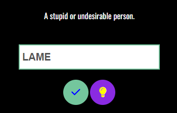
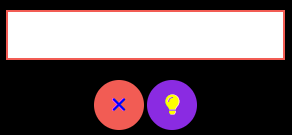
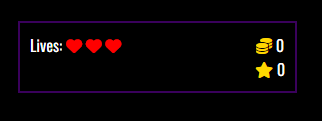

# WORDBIE
From the hints provided for you, guess the secret words to win coins!

Do you wish to play Wordbie?

## Tech stack:

     
    
    

## How to play Wordbie!

The rule of the game is to find a secret word based on its definition and hints provided for you.

Read the definition, guess the word and fill it into the input field provided!

      
Click on the button with a question mark to check if the word you entered is the right word.

            
If your word is correct, the input field turns green and you win 10 coins!!

If the word you entered is wrong, the input field turns red and you lose a life!

            
You have only 3 lives. Be careful not to lose all your lives or you lose the game.

You can also view hints by clicking on the hint button.

The hint consists of another definition of the word and 3 other hints.

 Made with :heart: by nalowa
 

       
